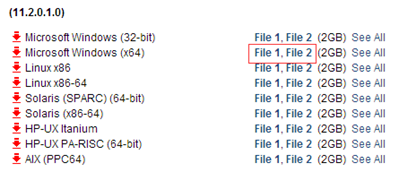
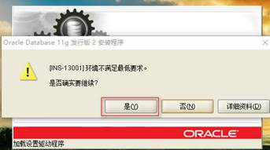
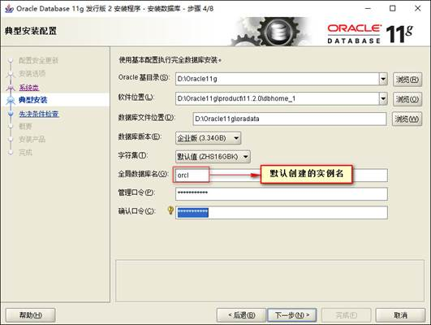
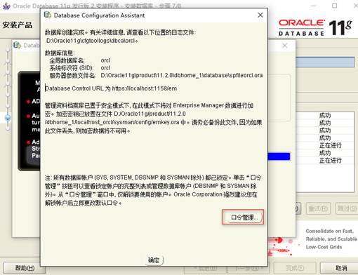
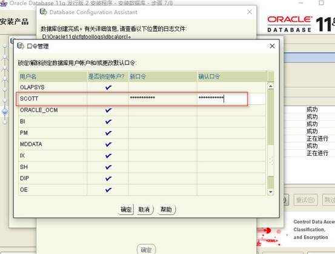
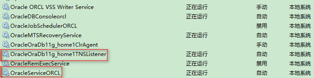
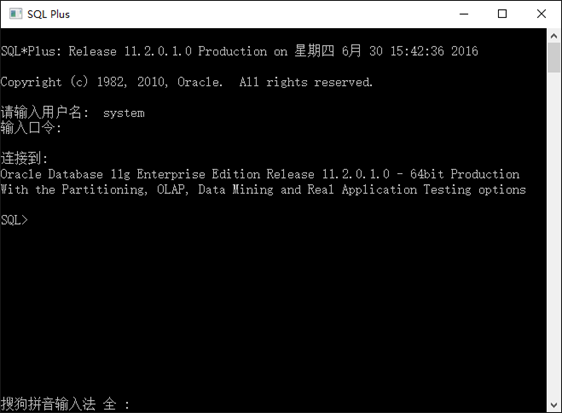
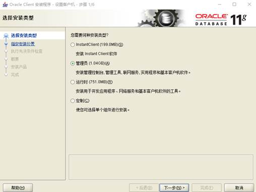
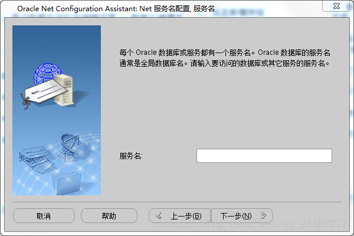
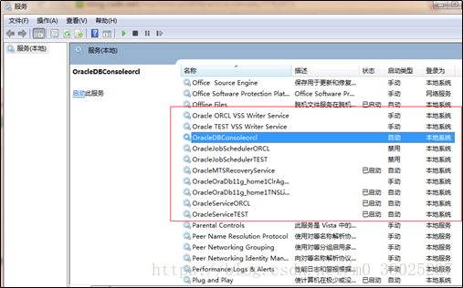

# 安装和卸载

可安装服务端，客户端(sqlplus，是一中命令行的界面) 和 PLSQL。

Oracle Client在服务器上和我们自己的电脑上都需要安装一个。在服务器上，用Oracle Client开启服务器监听；在自己电脑上，配置本地Net服务名。

安装PLSQL的话，必须要安装Oracle客户端，因为你PLSQL中的那个Database用的是安装Oracle客户端配置文件中的tnsname.ora文件的，也度就是你配置的连接远端的数据库的配置信息都保存在这个文件中，PLSQL也是读的这个连接描述符. 并且与客户端一致，为64位。

## 服务端的安装

1、安装包下载

　1)http://www.oracle.com/technetwork/database/enterprise-edition/downloads/index.html

　　

2、安装

- 　将2个压缩包解压到一个目录下，运行setup.exe

- 　出现下面提示，跳过

  

- 安装选项设置：选择“创建和配置数据库”。如果选择“仅安装数据库软件”，需要在安装完成后自行创建数据库。 推荐选择仅安装数据库软件，这样不容易出错。

- 系统类。由于咱们安装的是服务器，所以选择“服务器类”

- 网格安装选项：选择“单实例数据库安装”。

- 产品语言：默认中英文。

- 数据库版本：企业版多且强

- 安装位置：第一个安装路径是Oracle 的基目录，主要用于存放一些配置文件内容。第二个安装路径用于存储 Oracle 软件文件。这里用户可以根据实际情况选择安装目录。

- 先觉条件检查，该界面用来检查安装产品所需的最低配置

- 概要安装产品的概要信息：若在上一步某些系统配置不符合oracle的最低要求；则会在该界面显示出来；然后点击完成

- 安装产品

- 安装完成

1) 选择创建和配置数据库(这样数据库安装完成后，会默认创建数据库实例orcl)

　　

2) 设置安装路径、实例orcl的密码

　　

 3) 完成后点击 口令管理

  4) 默认sys和system用户可用，可以将scott用户解除锁定，并设置密码

   这样就可以用sys、system、scott这三个用户登录数据库

3、测试安装是否成功

  1) 打开服务(cmd—>services.msc)，所有的服务改成"手劢"

　　看到已经有oracle服务运行,将服务改为手动启动(需要开启oracle时，自己启动服务，减少资源消耗)

　　只需启动OracleOraDb11g_home1TNSListener和OracleServiceORCL这两个服务，oracle就可以使用

​			1)、监听服务：OracleOraDb10g_home1TNSListener 监听客户端的连接 

​			2)、数据库服务：OracleServiceORCL 命名规则：OracleService+实例名

  2) 运行SQL Plus，通过用户名/密码能够登录数据库，说明安装成功

## 客户端的安装

安装类型：选择管理员，功能全。

## 客户端配置

本地Net配置

 这里的服务名是Oracle数据库实例的名称，安装oracle时，如果没有修改默认数据库实例的名称，会自动新建一个名称为orcl的数据库实例。这里可以填写orcl。

或者通过配置连接字符串文件tnsnames.ora，可以连接远程服务器

## 完全卸载oracle11g

1、 开始－＞设置－＞控制面板－＞管理工具－＞服务，停止所有Oracle服务。

2、 开始－＞程序－＞Oracle_OraDB11g_Home1－＞OracleInstallation Products－＞Universal Installer，单击“卸载产品”-“全部展开”，选中除“OraDb11g_home1”外的全部目录，删除。

1. 运行regedit，清理注册表 
   1. 选择HKEY_LOCAL_MACHINE\SOFTWARE\ORACLE，按del键删除这个入口。
   2. 选择HKEY_LOCAL_MACHINE\SYSTEM\CurrentControlSet\Services，滚动这个列表，删除所有Oracle入口(以oracle或OraWeb开头的键)
   3. 选择HKEY_LOCAL_MACHINE\SYSTEM\CurrentControlSet\Services\Eventlog\Application，删除所有Oracle入口。
   4. 删除HKEY_CLASSES_ROOT目录下所有以Ora、Oracle、Orcl或EnumOra为前缀的键
   5. 删除HKEY_CURRENT_USER\Software\Microsoft\Windows\CurrentVersion\Explorer\MenuOrder\StartMenu\Programs中所有以oracle开头的键
   6. 删除HKEY_LOCAL_MACHINE\SOFTWARE\ODBC\ODBCINST.INI中除MicrosoftODBC for Oracle注册表键以外的所有含有Oracle的键。
2. 我的电脑-->属性-->高级-->环境变量，删除环境变量CLASSPATH和PATH中有关Oracle的设定。
3. 从桌面上、STARTUP（启动）组、程序菜单中，删除所有有关Oracle的组和图标。
4. 删除所有与Oracle相关的目录(如果删不掉，重启计算机后再删就可以了)包括：
   1.   C:\Program file\Oracle目录。 此目录为inventory内容连同oracle全部删除掉
   2.   ORACLE_BASE目录(oracle的安装目录)。x:\app\... 此目录为默认oracle安装主目录，连通app全删掉
   3.   C:\WINDOWS\system32\config\systemprofile\Oracle目录。
   4.   C:\Users\Administrator\Oracle或C:\Documentsand Settings\Administrator\Oracle目录。
   5.   C:\WINDOWS下删除以下文件ORACLE.INI、oradim73.INI、oradim80.INI、oraodbc.ini等等。
   6.   C:\WINDOWS下的WIN.INI文件中若有[ORACLE]的标记段，删除该段。
5. 如有必要，删除所有Oracle相关的ODBC的DSN
6. 到事件查看器中，删除Oracle相关的日志 说明： 如果有个别DLL文件无法删除的情况，则不用理会，重新启动，开始新的安装，安装时，选择一个新的目录，则，安装完毕并重新启动后，老的目录及文件就可以删除掉了。

## 问题：

1. Oracle服务端安装，最后提示需要安装.NET Framework 3.5, 最终监听服务和代理等服务无法安装配置（如OracleServiceORCL核心服务，Oracle*Listener客户端监听服务，OracleDBConsoleorcl控制台后台服务。

2. oracle11g，使用sqlplus username/password登录出现协议适配器错误，

   原因：Oracle的Listener，OracleServiceORCL服务没有启动。

3. PLSQL连接Oracle的问题：SQL*Net not properly installed

   原因：软件版本问题（32位，64位）。

4. ORA-12541:TNS:无监听程序
    解决方法：重新配置Oracle Net 监听程序