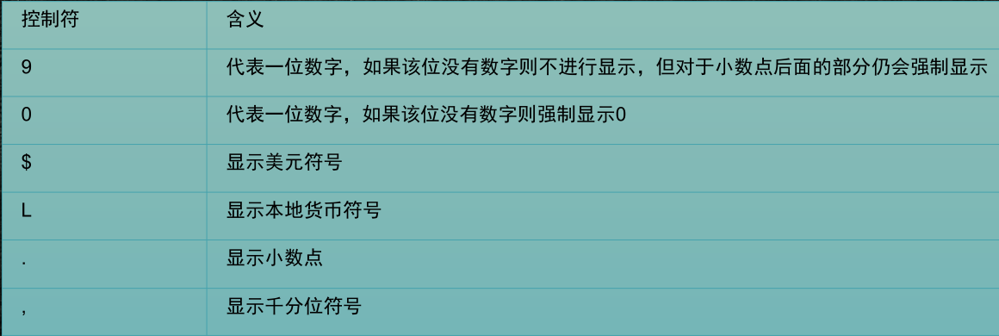

#### 函数

1.  Sql函数可以分为组函数和单行函数。

   1. 组函数：被称作聚合函数，用亍对多行数据进行操作，幵返回一个单一的结果，组函数仅可用亍选择列表或查询的having子句。
   2. 单行函数：对单个数值进行操作，幵返回一个值。

2. 单行函数：

   1. 字符函数：以字符作为参数，返回值分为两类：一类返回字符值，一类返回数字值。

   2. 数字函数：以NUMBER类型为参数返回NUMBER值

   3. 日期类型：以内部数字格式存储日期:世纪,年,月,日,小时,分钟,秒

   4. 转换函数：标量数据可以有类型的转换，转换分为两种，隐式类型转换和显示类型转换。

      TO_CHAR，日期和数字的显示格式。

      

      

   5. 条件函数：decode，case when.

   6. 通用函数：NVL

      1.  Sql中允许列值为空，空值用保留字NULL表示。NULL不同于0或者空格，它就是代表了一个不确定的内容。任何含有null值的数学表达式最后的结果都为空值。
      2.  函数nvl将NULL转换成为一个‚actual value”

   7. 单行函数嵌套： 嵌套函数从最深层到最低层求值。

3. 组函数：组函数仅在选择列表和Having子句中有效

   1. avg，min，max，sum，count
   2. 数字类型数据使用AVG 和SUM 函数
   3.  MIN 和MAX适用亍任何数据类型
   4. 组函数除了count(*)外，不能处理空值null，可以使用NVL函数迫使分组函数包括空值。
   5. 不能在 WHERE 子句中使用组函数.不能在 WHERE 子句中限制组. 使用Having对分组进行限制

