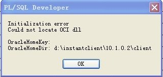

# **介绍**

一、数据库的版本 Oracle11g:完整性产品,最新版本2G。其中g表示的是网格计算。以平面网格，以中心查找, 更好地支持集群和多点应用。 Oracle12c:the world's first database designed for the cloud 云端数据库。

​	  例如：创建的数据库的名称和SID为：bjmsb 。

 二、用户和角色 

1)、角色：**sysdba** 数据库管理员，拥有最多权限，包括：打开和关闭、备份和恢复数据库、日志管理、会话管理、创建数据库、用户管理等。 
	   默认用户：**sys** 超级管理员 bjmsb 

2)、角色：**sysoper** 数据库操作员，包括权限：打开和关闭、备份和恢复数据库、日志管理、会话管理。 
		默认用户：**system** 普通管理员 bjmsb 

3)、角色：**normal** 普通用户，只有查询表的权限。 
		默认用户：**scott** 普通用户 tiger

三、实例 -->数据库

1. 数据库服务器由一个数据库和至少一个数据库实例构
2. 数据库：一组存储数据的文件
3. 数据库实例：管理数据库结构的内存结构

四、数据库实例名 统一使用orcl

# **账户管理**

使用scott用户登录,第一次登录的时候会显示账户锁定，需要将账户解锁：

1)使用DBA登录： 

​	运行命令行工具 

​	sqlplus /nolog;  --不以任何用户登录，打开sqlplus软件，但不进行连接数据库的操作。

​	conn sys/bjmsb@orcl as sysdba;   --连接。 或者conn / as sysdba;

​	show user;  --查看当前用户

​	passw;   --修改密码

​	set pagesize 20;  ---设置每页显示的行数

​	set liinesize 150; ---设置sqlplus输出的最大行宽

​	set numwidth 4;   ---number类型字符大小,默认为10.

2)用户解锁命令： alter user scott account unlock|lock;   ---统一密码：tiger

3)测试： conn scott/tiger@orcl; 要求重新输入密码，确认你自己的密码即可

## 若输入命令没有分号，返回2，继续输入分号，则成功

# SQL语言

结构化查询语言 (Structured Query Language)，具有定义、查询、更新和控制等多种功能，是关系数据库的标准语言。

SQL分类：
– 数据操纵语言**DML** Data Manipulation Language :
	▪ SELECT INSERT UPDATE DELETE
– 数据定义语言**DDL** Data definition language :
	▪ CREATE ALTER DROP RENAME TRUNCATE
– 数据控制语言**DCL** Data Control Language :
	▪ GRANT REVOKE。(权限授予GRANT语句和权限收回REVOKE语句是实现数据安全控制功能的语句)
– 事务Transaction:
	▪ commit rollback savepoint

# 内置数据表

SELECT * FROM TAB; ---当前用户下的所有表和视图

SELECT * FROM USER_TABLES; ---当前用户下的所有表

select * from all_tables a where a.OWNER = upper('数据库用户名');   --选择用户下都有哪些表

select t.table_name,f.comments from user_tables t  inner join user_tab_comments f on t.table_name = f.table_name;  --查询当前用户下所有表的表名和表说明：

select t.column_name from user_col_comments t;   --查询当前用户下所有表的字段名

DESC TABLENAME;  --查看表结构

select * from all_directories;    --oracle查询directory_path

 select * from dba_users where username=upper('用户名');  --查看当前用户属于的表空间

# 数据库的使用

为jhicu数据库创建用户，用户名： JHICU，密码 JHICU，并分配表空间 jhicuspace_01，并给用户赋予权限

还用cmd  sqlplus 登陆  sys/123456 as sysdba 进去 ，

##### 创建表空间执行：

CREATE TABLESPACE jhicuspace_01
DATAFILE 'D:\app\Hades\oradata\sycomk\jhicuspace_01.dbf'
SIZE 200M
AUTOEXTEND ON;

##### 创建用户执行：

CREATE USER JHICU
IDENTIFIED BY JHICU
DEFAULT TABLESPACE jhicuspace_01
TEMPORARY TABLESPACE temp;

##### 为用户赋权限执行：

GRANT CREATE SESSION,CREATE TABLE,CREATE VIEW,CREATE SEQUENCE,UNLIMITED TABLESPACE TO DSOA; 
GRANT CONNECT TO DSOA; 
GRANT RESOURCE TO DSOA; 
GRANT DBA TO DSOA;

##### cmd打开直接执行数据导入：

imp jhicu/jhicu@JHICU file=D:\app\Administrator\admin\jhicu\dpdump\jhicu.dmp full=y

新版本使用 impdp 

 impdp jhicu/jhicu@10.1.1.14/JHICU directory=DATA_PUMP_DIR dumpfile=jhicu.dmp table_exists_action=replace

##### 数据泵还原数据报错：

ORA-39000: 转储文件说明错误 ORA-39143: 转储文件 "D:\app\Administrator/admin/jhicu/dpdump/jhicu.dmp" 可能是原始的导出转储文件

原因是 导出的时候是用exp方法导出的，使用impdp。无法识别exp命令导出的文件，所以用了imp方法还原数据成功。

### oracle:could not locate oci.dll 

在使用PL/SQL时出现如下错误，因为PL/SQL的运行需要安装Oracle客户端。

