1、 打开Database Configuration Assistant进行数据库的创建

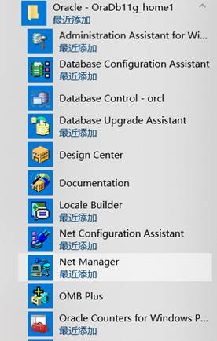

2、 直接点击下一步开始创建

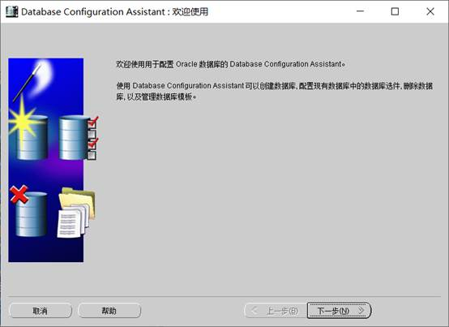

3、 选择第一个选项，创建新的数据库，同时可以进行数据库的删除和配置等操作

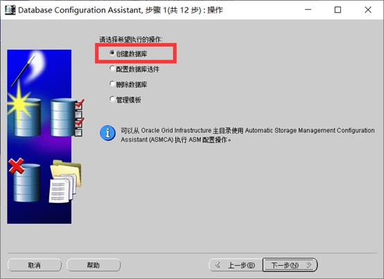

4、 选择创建什么用途的数据库实例，默认选择第一个

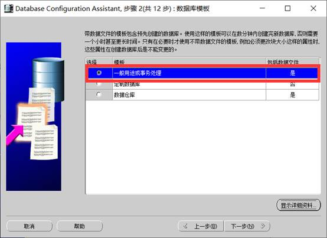

5、 填写数据库的名称和SID

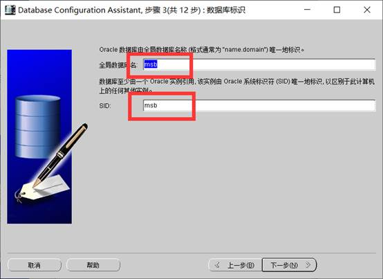

6、 要求配置管理器，默认选项即可，不需要做任何修改

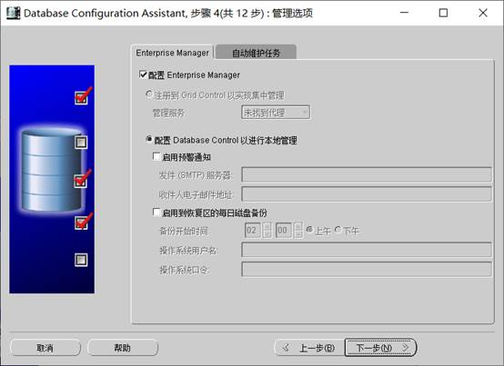

7、 此处填写实例数据库的密码，建议设置统一密码，方便记忆

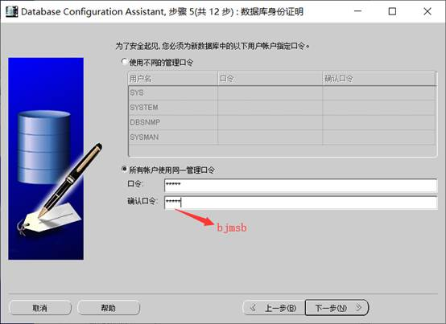

8、 弹出警告信息，忽略即可

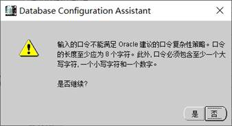

9、 后续几个步骤的操作需要做详细的配置，初学者保持默认即可

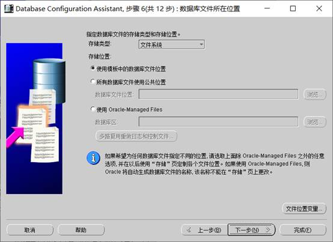

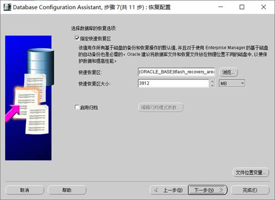

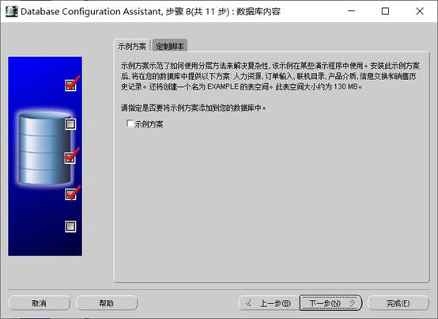

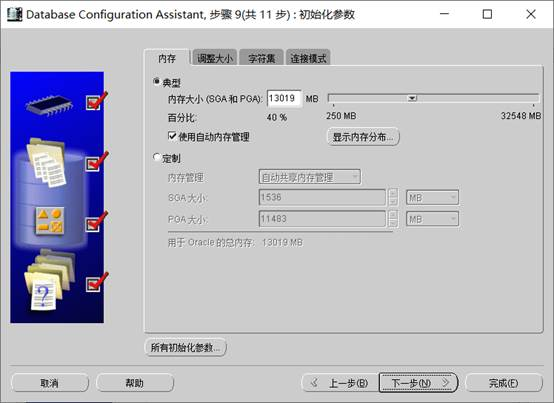

10、     当看到如下页面之后表示数据库的相关配置已经完成，点击下一步即可

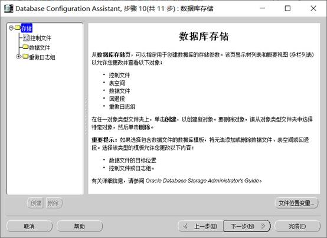

11、     开始前的最后一次确认，创建数据库

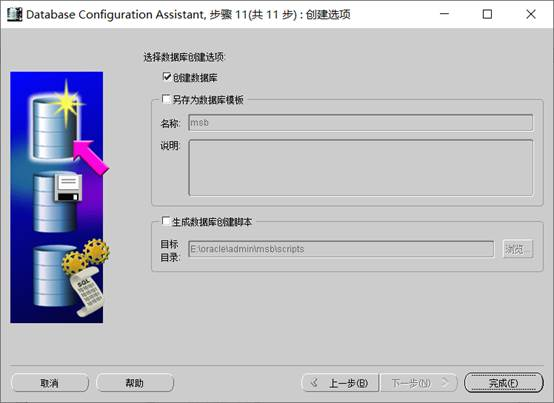

12、     点击完成之后会弹出数据库的详细参数配置信息

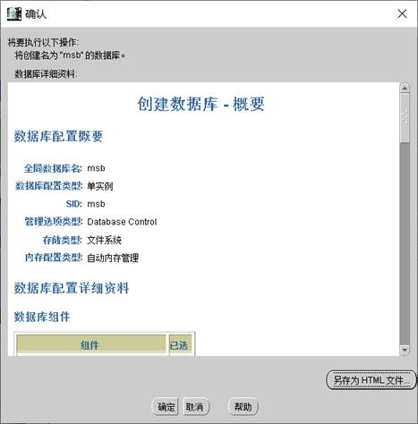

13、     看到如下页面表示数据库正在创建，等待即可，持续时间可能有几分钟

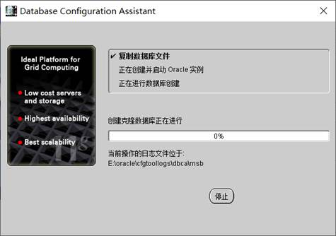

14、     又进入口令管理页面，按照刚刚的配置即可

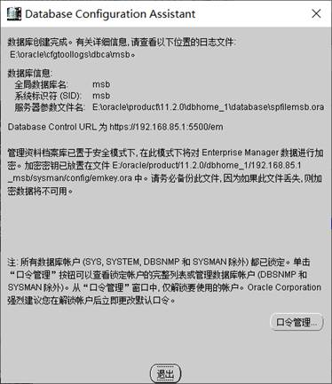