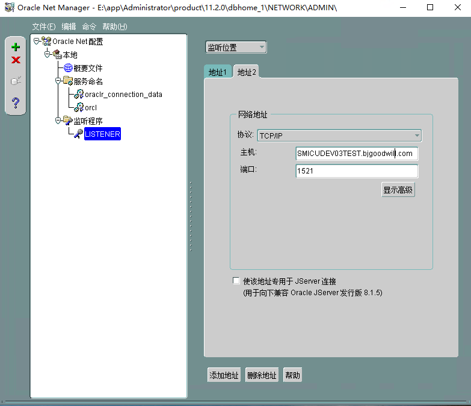
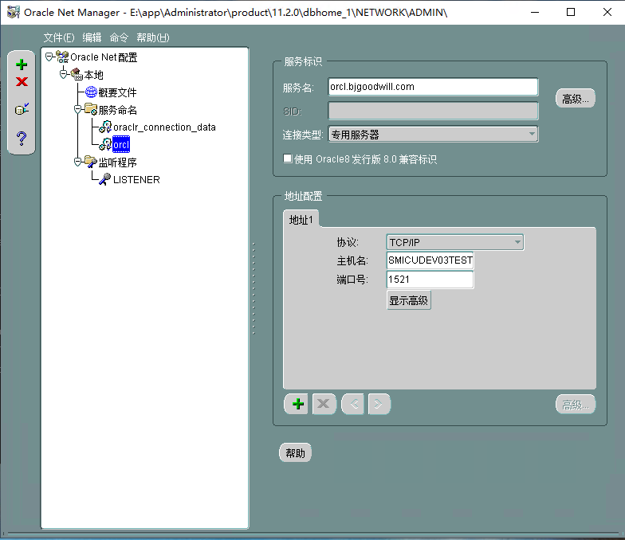
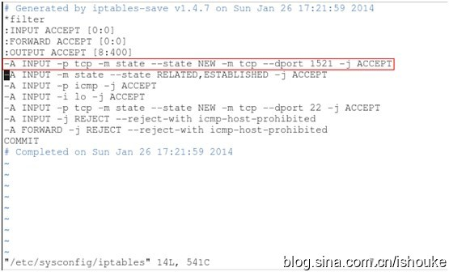

### 客户端与服务器端的通讯机制

Oracle监听器：用来接收来自客户端的连接请求的组件。发送给数据库的客户端连接请求，首先被服务器端的监听器所侦听，并将请求所转交给对应的数据库实例，从而建立起客户端与服务器的连接。连接建立后，客户端与服务器端就可以直接进行通讯，不再需要监听器参与。

Oracle网络服务名：是一个标识符，它代表着客户端连接服务器的配置信息（实际上就是连接请求的内容），包括数据库主机地址、监听端口、全局数据库名称等内容

客户端与服务端的连接过程为:

 （1）首先在服务器端有一个常驻的监听器（监听服务要打开）监听客户端发出的连接请求。

 （2）用户在客户端（企业服务器或SQL工具）输入用户名、口令及网络服务名，或在SQL命令行中输入类似CONNECT username/password@net_Service_name”的类似请求。

 （3）客户端查看网络服务配置文件tnsname.ora，将网络服务名映射为包含Oracle服务器地址、监听端口和全局数据库名的连接描述符。

 （4）客户端根据连接描述符定位监听器，并通过网络将连接信息传递给监听器。

 （5）监听器查询监听配置文件listener.ora，找出所要连接的数据库服务器。

 （6）客户机和服务器开始通信。

说明：

一，简单来说连接分为以下两种

1.本地连接:形如sql>conn user/pwd

​	如：conn JHICUV3/JHICUV3

2.远程连接:形如sql>conn user/pwd@service_name

​	如：conn JHICUV3/JHICUV3@orcl (网络服务的配置)
​			conn JHICUV3/JHICUV3@192.168.17.76/orcl.bjgoodwill.com (网络服务的主机名和服务器名)

### 服务端配置

监听程序配置：协议，主机，端口。对应配置文件listener.ora。

本地网络服务名配置：服务名，主机名，端口号，协议。对应的配置文件为tnsnames.ora。**主机名与监听程序的主机名一致，或使用IP地址**

### 客户端配置

本地网络服务名配置：服务名，主机名，端口号，协议。**服务名与服务器的服务名一致，主机名可为服务器的IP地址或主机名**。

##### 保证客户端机器连接到oracle数据库要满足以下条件

A． 客户端
1．在客户端机器上安装ORACLE的Oracle Net通讯软件，它包含在oracle的客户端软件中。
2．正确配置了sqlnet.ora文件
3．正确配置了tnsname.ora文件

B． 服务器端
1．保证listener已经启动 lsntctl start
2．保证数据库已经启动。 sql>startup

##### 常见错误

1. ORA-12560: TNS:protocol adapter error。

   原因：错误的连接命令conn。格式不对。

2. ORA-12154: TNS:could not resolve the connect identifier specified

   原因：连接命令的参数service_name错误，不能是服务名，而是服务配置标识。

3. ORA-12514: TNS:listener does not currently know of service requested in connect
   descriptor 监听程序无法识别连接描述符中请求的服务。

   原因：监听程序未启动。或者客户端的本地网络服务名配置错误，服务名要与服务器上配置的服务名一致。

4. ORA-12541:TNS:无监听程序。

   解决：监听程序配置若没错，那么尝试在cmd命令行下先停止监听，再启动监听lsnrctl stop，lsnrctl start。

5. linux下远程oracle主机，发现主机内部都可以测试通过，外面也可以ping通oracle主机，但是总是提示tns超时连接，关闭防火墙也不行，咋办？

   解决方法：

   1.停止防火墙

   [root@localhost ~]# service iptables stop 

   2.编辑防火墙配置文件

   [root@localhost ~]# vim /etc/sysconfig/iptables 

   在文件中添加红色选框的内容

   

    然后保存配置文件

   3.重启防火墙：

   [root@localhost ~]# service iptables restart

   iptables: Flushing firewall rules: [ OK ]

   iptables: Setting chains to policy ACCEPT: filter [ OK ]

   iptables: Unloading modules: [ OK ]

   iptables: Applying firewall rules: [ OK ]

   如下操作保存配置，以便linux重启后依然有效 

   [root@localhost ~]# service iptables save 

   iptables: Saving firewall rules to /etc/sysconfig/iptables:[ OK ]